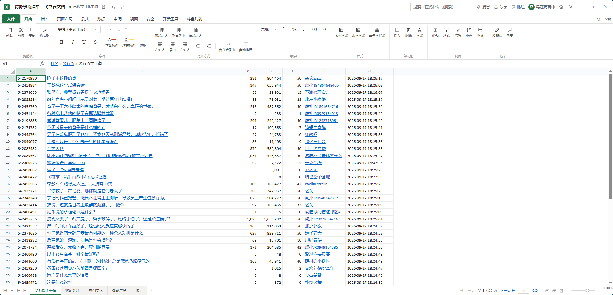
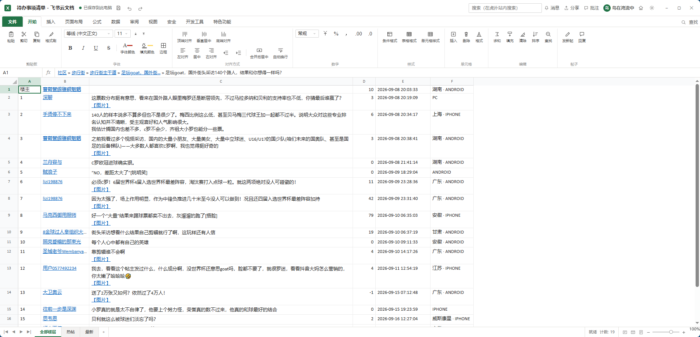
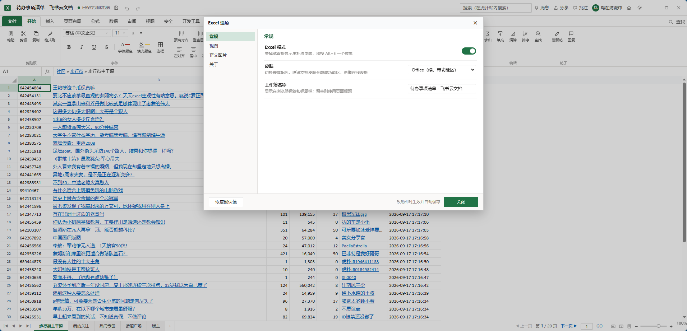
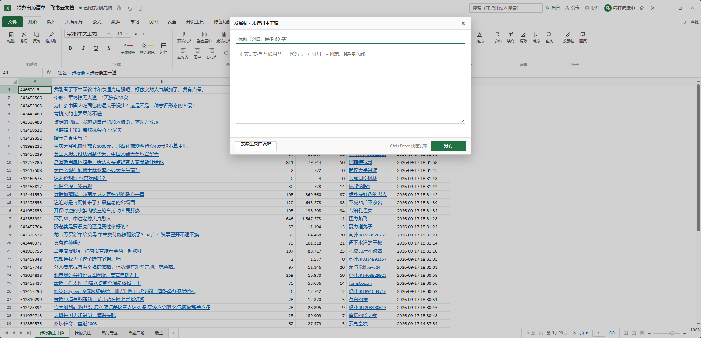
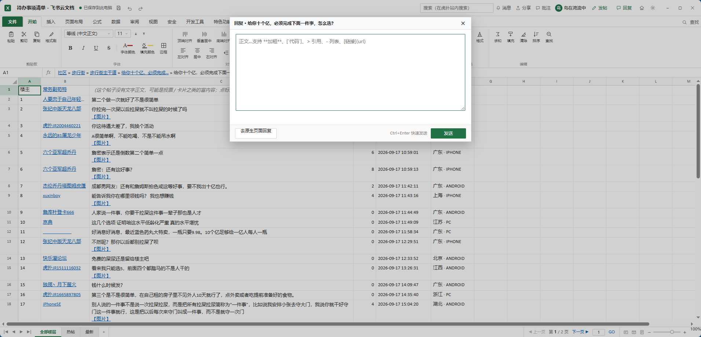

# 虎扑 Excel · 摸鱼模式

把 `bbs.hupu.com` 伪装成一个 Excel 工作簿的油猴脚本（Tampermonkey / Violentmonkey / Greasemonkey）。

- 脚本文件：**`hupu-excel.user.js`**
- 参考实现：[`reference/nga-excel.js`](reference/nga-excel.js)（NGA 优化摸鱼体验的 Excel 模式）、[`reference/nga-codex.user.js`](reference/nga-codex.user.js)（数据读取 / 结构化渲染的思路）、[`reference/hupu-codex.user.js`](reference/hupu-codex.user.js)（虎扑版 Codex 外观；发帖 / 回帖接口就是从它这儿对出来的）

## 截图

**主页面** —— 版面列表页（`/bxj` 这类）：帖子流 + 底部工作表标签（版面名 / 我的关注 / 热门专区 / 话题广场 / 版主），功能区最后一组就是「发新帖 / 回复」



**帖子详情** —— `/123456789.html`：全部楼层 / 热帖 / 最新，编辑栏里那串面包屑一直可点



**设置面板** —— 右上角 ⚙ 打开的「Excel 选项」



发帖 / 回帖两个弹框的样子见下面的「发帖 / 回帖」一节。

## 安装

1. 浏览器装好 Tampermonkey（或 Violentmonkey）。
2. 打开 Tampermonkey 面板 → 添加新脚本 → 把 `hupu-excel.user.js` 全文粘进去 → Ctrl+S。
3. 打开 <https://bbs.hupu.com/bxj> 之类的版面页即可。

## 快捷键

| 快捷键 | 作用 |
| --- | --- |
| `Alt+E` | 开关 Excel 模式（会记住） |
| `Esc` | 老板键：立刻切回虎扑原页面，再按一次回来（不写存储）；设置面板开着时先关面板 |
| `↑ ↓ ← →` | 像 Excel 一样移动选中的单元格，名称框 / 编辑栏同步 |
| `PageUp` / `PageDown` | 上下翻 20 行 |
| `Home` / `Ctrl+Home` / `End` | 跳到本行首列 / A1 / 本行末列 |
| `Enter` | 单元格里有链接就打开（标题、作者），否则下移一格 |
| `Ctrl+PageDown` / `Ctrl+PageUp` | 切换工作表 |
| `Alt+←` / `Alt+→` | 上一页 / 下一页 |
| `Ctrl+Enter` | 发帖 / 回帖弹框里：直接发布 |

标题栏右上角还有两个按钮：🏠 回社区首页、⚙ 打开设置面板；编辑栏里那串面包屑（`社区 » 步行街 » 动物萌宠区 » … » 帖子标题`）也是可以点的链接。

功能区的最后多了一组**「帖子」**按钮：**发新帖**、**回复**（详见下面的「发帖 / 回帖」）。

> 编辑栏**一直**显示这串面包屑和标题，点击帖子里的回复不会把它换成单元格内容 —— 所以「回上一层」的入口和当前页标题在任何时候都在，单元格内容看格子本身就行。

## 发帖 / 回帖

功能区最后一组「帖子」里有两个按钮：

| 按钮 | 什么时候能用 | 行为 |
| --- | --- | --- |
| **发新帖** | 版面页 / 帖子页（能拿到版面信息时） | 弹框填标题 + 正文，发到当前版面 |
| **回复** | 帖子页 | 弹框写正文；表格里正选中某一层时，默认引用该层做成楼中楼（可点「取消引用」改成直接回帖） |

**发新帖** —— 填标题 + 正文，发到当前版面：



**回复** —— 写正文，`Ctrl+Enter` 发送；选中某一层再点「回复」会多出一行「引用 @某人（N 楼）」，那就是楼中楼：



正文支持极简 markdown：**加粗**、*斜体*、行内代码（反引号）、`> 引用`、`- 列表`、`[文字](https://…)`，发布时转成站内编辑器那种 HTML。弹框里 `Ctrl+Enter` 直接发布，`Esc` 关闭。

走的是站点自己的接口（和原生页面发帖 / 回帖是同一个请求）：

```
POST /pcmapi/pc/bbs/v1/createThread   发新帖
POST /pcmapi/pc/bbs/v1/createReply    回帖 / 楼中楼
```

- 凭登录 cookie（`credentials: include`），不需要额外 token。**未登录会直接提示**：帖子页没有 `isLogin` 字段，这里用 `__NEXT_DATA__` 的 `pageProps.euid` / `detail.user.puid` 两个间接信号判定；判不出来时不拦，交给服务端。
- 会带上数美反欺诈设备号（`window.SMSdk.getDeviceId()`，页面自己加载的 `smDeviceSdk2.js`）；拿不到就不带。
- 发布 / 回复成功后**软导航刷新**当前页（新帖会直接跳过去），不换文档、不闪原生页面。
- 接口失败会把服务端的原话显示在弹框里；两个弹框都留了「去原生页面发 / 回」的退路，接口万一改版也不至于没法用。

> 说明：接口的成功路径没法在无账号环境实测，字段是从站点自己的编辑器代码（动态 chunk `reply-compact-editor`）里对出来的 —— 失败路径和字段名都对得上，真发出去的效果请以实际为准。

## 设置面板

标题栏右上角的 ⚙ 按钮会弹出「Excel 选项」（长什么样见上面的[截图](#截图)），左边是分组导航，右边是全部可配置项，改完立即生效并存进油猴存储（脚本**不注册任何油猴菜单项**，配置全在这一个面板里）：

| 分组 | 配置项 | 默认 |
| --- | --- | --- |
| 常规 | Excel 模式（开关） | 开 |
| 常规 | 皮肤：Office / 腾讯文档 / WPS | Office |
| 常规 | 工作簿名称（浏览器标签标题） | 工作簿1 |
| 视图 | 显示账号区（登录/消息/分享/批注 + 昵称头像） | 开 |
| 视图 | 显示「路径」列 | 关 |
| 视图 | 冻结列标行 | 开 |
| 视图 | 空白行填充（滑块 0–200 行） | 40 行 |
| 视图 | 空白列填充（滑块 0–40 列） | 8 列 |
| 正文图片 | 显示正文图片（关掉后图片折叠成「【图片】」链接） | 开 |
| 正文图片 | 缩略图宽度上限（滑块 120–600px） | 260px |
| 正文图片 | 缩略图高度上限（滑块 80–400px） | 170px |
| 正文图片 | 鼠标悬停浮出大图 | 开 |
| 正文图片 | 悬停大图宽度上限（滑块 200–1600px） | 640px |
| 正文图片 | 悬停大图高度上限（滑块 160–1200px） | 480px |
| 正文图片 | 悬停大图不透明度（滑块 20–100%） | 100% |
| 关于 | 快捷键一览 | — |

> 关掉「Excel 模式」后界面会完全消失（也不再有齿轮）。想再打开就按 `Alt+E`，或直接在油猴里删掉存储的 `hx.cfg`。

## 它工作在哪张表上

| 页面 | 工作表 | 行数 | 列 |
| --- | --- | --- | --- |
| 版面列表 `/bxj`、`/bxj-2` … | 版面名（默认表） | 49 | 编号 / 标题 / 回复 / 浏览 / 点亮 / 作者 / 最后回复 / 路径 |
| | 我的关注 | 关注数 | 同上 |
| | 话题广场 | 13 段 + 255 | 分类段标题行 + 序号 / 板块 / 热度 / 路径 |
| | 版主 | 6 | 序号 / 角色 / 用户名 / 主页 |
| 分类页 `/all-gambia`、`/all-sports` … | 分类名（默认表） | 70 | 版块 / 编号 / 标题 / 点亮 / 回复 / 路径 |
| | 分类名 · 板块 | 该分类下的板块 | 序号 / 板块 / 分类 / 热度 / 路径 |
| 帖子页 `/123456789.html`、`/-2.html` | 全部楼层 | 楼主 + 20 | 楼层 / 作者 / 内容 / 点亮 / 时间 / 属地·端 |
| | 热帖、最新 | 各 10 | 编号 / 标题 / 回复 / 浏览 / 作者 / 时间 |
| 社区首页 `/` | 我的关注 | 关注数 | **只放我关注的板块**（序号 / 板块 / 分类 / 热度 / 路径）；拿不到关注列表时首行给说明并用热门兜底 |
| | 热门专区 | 20 | 只有拿到关注列表时才另开这张表 |
| | 话题广场 | 13 段 + 255 | 分类段标题行 + 序号 / 板块 / 热度 / 路径 |
| | 站内热帖 | 70 | 版块 / 编号 / 标题 / 点亮 / 回复 / 路径 |

「路径」列默认隐藏，可在设置面板里打开。

## 底部工作表标签 = 页面自己的分区

首页和版面页的左侧栏都是同一套导航（`我的关注` + `话题广场`），所以这两张表在两个页面上都有，底部标签直接对应页面分区，点一下就能在「这个版面的帖子」「我关注的/热门板块」「全站板块目录」之间切：

```
社区首页  →  我的关注 │ 话题广场 │ 站内热帖
版面页    →  步行街主干道 │ 我的关注 │ 话题广场 │ 版主
帖子页    →  全部楼层 │ 热帖 │ 最新      （帖子页没有左侧栏）
```

未登录时「我的关注」表首行会有一条灰色说明，下面跟热门板块（来源列标「热门」）；登录后关注的板块排在最前（来源列标「我的关注」）。首页底部的工作表标签直接对应页面左侧栏的分区（我的关注 / 话题广场），点标签就能在「我关注的板块」「全站板块目录」「热帖」之间切。

## 它是怎么工作的

**数据读取**（结构化数据优先，DOM 兜底）

| 来源 | 拿到什么 |
| --- | --- |
| 内联 `window.$$data`（列表页 `topic`、首页 `pageData`） | 列表页：49 条帖子（含 **点亮数**）、热门专区、版主列表、分页；首页：我的关注 `follow`、20 个热门板块、13 个分类、**70 条**推荐流 |
| 页面左侧栏 DOM（首页、版面页都有） | 「话题广场」区 13 个分类下的**完整** 255 个板块（内联 JSON 里每个分类只带了前几个，所以名单以 DOM 为准，热度数字用 JSON 覆盖成精确值）；「我的关注」区登录后就是真实关注列表 |
| `<script id="__NEXT_DATA__">`（帖子页 SSR） | 标题 / 正文 / 楼层 / 点亮 / 属地 / 客户端 / 分页 |
| DOM 解析 | 上面都拿不到时的兜底 |

**伪装**

- 原生 DOM 只是 `display:none` 藏起来（不移除），站点自己的 JS、登录态、埋点都照常；
- **站内链接走软导航**：`fetch` 回目标页 HTML、解析出数据后在同一个文档里重画，浏览器不换文档，所以切版面 / 进帖子 / 翻页不再闪原生页面（拿不到数据或失败时退回整页跳转）；
- **首帧就是 Excel**：`document-start` 时先给 `<html>` 打上锁，`<body>` 一出现就把外壳（标题栏/功能区/编辑栏/「正在打开 工作簿1.xlsx…」）立起来，数据等 `DOMContentLoaded` 再填 —— 真实站点从首帧到 DCL 有 1～2 秒，不等它，否则那段时间是白屏／原生页面；
- 隐藏规则是「`body` 下除了 `#hx-root` 全隐」，不写死 `#container` / `#__next`：错误页、WAF 拦截页、以后改版的容器都不会漏出来；
- 带看门狗：万一站点把我们加的 `hx-on` / `#hx-root` 弄掉（或者脚本注入晚了），`readystatechange` / `pageshow` / `focus` 和几个定时器会把状态拉回来；
- 自己画整窗 Excel：标题栏 / 选项卡 / 功能区 / 编辑栏 / 行列标（A…Z、AA…）/ 冻结窗格 / 工作表标签 / 状态栏 / 缩放条，3 套皮肤；
- 账号区读页面顶部 `.hp-topLogin-info`（站点 JS 异步填的昵称与头像），并用 MutationObserver 跟着刷新；
- 全部图标是内联 SVG，favicon 是即时生成的 SVG data URI，**不依赖任何外部资源**；
- 样式全部限定在 `#hx-root` 内并做了一层 scope reset，不会被虎扑的 CSS Modules 串味；
- 单元格支持选中（绿色选中框 + 名称框/编辑栏联动）、行号列标高亮、长内容自动换行并可滚动；
- 帖子图片以缩略图贴在单元格里（尺寸可在设置面板里调），**鼠标悬停会在旁边浮出原图并标出尺寸**：原图地址自动取 `data-origin`，没有的话去掉虎扑图床的缩放参数（`x-oss-process=image/resize,w_800` / `imageMogr2/…`）就是原图；大图的宽度 / 高度上限和不透明度也能在设置面板「正文图片」里调（默认 640×480、100% 不透明，再大也不会超出视口）；**点击图片**会在当前页盖一层看原图（Esc 或点任意处关闭），不再跳新标签 —— 关掉「显示正文图片」时的「【图片】」链接也一样。正文格和含图格**不挂 `title`**，所以鼠标移到图片上不会弹出原生提示把图挡住（其它列仍然悬停看全文）。
- **视频帖不会空白**：视频帖的正文本身是空的（视频在 `thread.video` / `format.videoInfo` 里），正文格会显示**封面图 + 「▶ 播放视频」**链接；其它没有文字正文的富内容（投票、卡片…）会给一句说明。

## 说明

- 只在 `bbs.hupu.com` 生效，只改外观、不碰账号数据；站内软导航会用 `fetch` 取目标页的 HTML（同源、带 cookie，和点链接本身是同一种请求），此外不向任何第三方发请求。
- 仅用于上班摸鱼的个人娱乐，请遵守公司网络使用规定。
